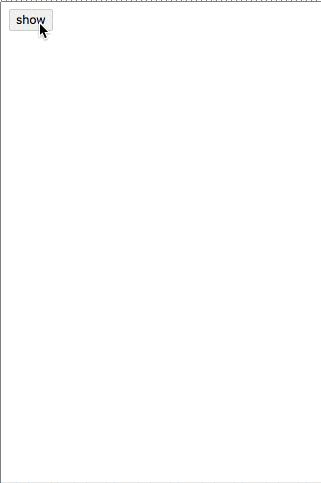

# vue-cityPicker
vue2.0+ 移动端 城市选择器
仿京东app的地址管理的城市选择器ui


## install
use npm
````
npm install vue-citypicker --save
````

## usage

````
<template>
  <div id="app">
    <button type="button" name="button" @click="visible = !visible">show</button>
    <CityPicker
      @on-finish="handleFinish"
      v-model="visible"
      :defaultData='defaultData'></CityPicker>
      <p v-for="(value, key) in selected">
        {{value.name}} | {{value.code}}
      </p>
  </div>
</template>

<script>
import CityPicker from 'vue-citypicker';

export default {
  name: 'app',
  components: {
    CityPicker,
  },
  data() {
    return {
      visible: false,
      defaultData: [],
      selected: {},
    };
  },
  methods: {
    handleFinish(selected) {
      this.selected = selected;
      this.defaultData = [selected.province.code, selected.city.code, selected.area.code];
    },
  },
};
</script>

<style lang="less">
button{
  border: 1px solid #ccc;
  background-color: #f0f0f0;
  border-radius: 2px;
}
</style>
````

## options

#### attributes
| 属性          | 说明                     | 类型      | 默认值   |
| ----------- | ---------------------- | ------- | ----- |
| value       | 控制是否显示，可以用`v-model`来绑定 | Boolean | false |
| defaultData | 设置默认显示数据               | Array   | []    |

 #### options
| 方法        | 说明     | 类型       | 返回值                                      |
| --------- | ------ | -------- | ---------------------------------------- |
| on-finish | 选择后的回调 | Function | `Object`, 例子： `{ province : { name: '北京市', code: '11000' }, city: {name: '东城区', code: '110101' }, area: { name: '', code: '' } } ` |
